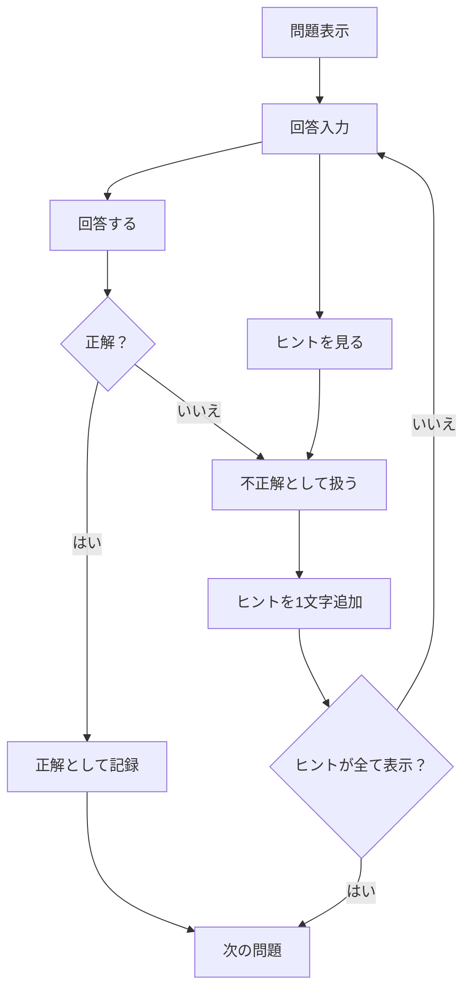

# 基本情報技術者試験 用語アウトプットアプリ 要件定義書

## 1. アプリ概要

### アプリ名（仮）

FE-Output

### 目的

基本情報技術者試験の用語を「思い出して入力する」ことで知識の定着を図るアウトプット特化型Webアプリ。

本アプリは、参考書や学習サイトなどで基本的な知識を学習した後の復習・知識定着を目的とする。

---

# 2. コンセプト

本アプリは、**知識を思い出す（想起する）こと**を重視した学習ツールである。

ユーザーは表示された解説を読み、該当する用語を入力する。

思い出せない場合は段階的にヒントが表示され、最終的には答えを確認しながら学習できる。

---

# 3. 想定ユーザー

- 基本情報技術者試験の学習者
- 用語をある程度学習済みで、知識の定着を図りたい人
- インプットではなくアウトプット学習をしたい人

---

# 4. 機能要件

## 4.1 トップ画面

### 表示項目

- アプリタイトル
- 出題分野選択（ネットワーク・データベース・セキュリティ・全分野）
- 出題数選択（任意）
- スタートボタン

### 機能

- 出題分野を選択する
- 問題数を選択する
- 学習開始

---

## 4.2 問題画面

### 表示項目

- 現在の問題番号
- 全問題数
- 解説
- 回答入力欄
- 現在のヒント

### 機能

- 解説を読んで用語を入力する
- Enterキーで回答
- 正解したら次の問題へ進む
- 不正解の場合はヒントを段階的に表示する
- 5回不正解でヒントを全て表示
- ヒントが全て表示された場合は正解を表示し、自動的に次の問題へ進む

---

## 4.3 ヒント機能

不正解になるたび、またはヒント表示ボタン押下時に、正解の用語を虫食い形式で少しずつ表示する。

例）

```
データベース

×

デ _ _ _ _ _

×

デー _ _ _ _

×

データ _ _ _

・・・

データベース
```

全て表示された場合は、その問題を不正解として次の問題へ進む。

---

## 4.4 判定

### 正解

- 次の問題へ進む

### 不正解

- ヒントを1段階追加する

### ヒント追加ボタン押下

- 不正解として記録する
- 次の問題へ進む

### ヒントを全て表示

- 不正解として記録する
- 次の問題へ進む



---

## 4.5 リザルト画面

### 表示項目

- 出題分野
- 出題数
- 正解数
- 不正解数
- 正答率
- 間違えた用語一覧

### 機能

- トップへ戻る
- 同じ条件でもう一度挑戦する

---

# 5. 非機能要件

- 制限時間は設けない
- 知識の想起を優先する
- シンプルで迷わないUIとする
- PCブラウザでの利用を想定する

---

## 6. 回答判定

ユーザーが入力した回答は、学習体験を損なわないよう、できる限り表記ゆれを吸収して判定する。

### 判定ルール

- 前後の半角・全角スペースを無視する
- 英字の大文字・小文字を区別しない
- 英数字の全角・半角を統一して判定する
- 記号（`-`、`/`、`・` など）の違いは可能な範囲で吸収する

### エイリアス（別名）対応

1つの用語に対して、別名や正式名称を複数登録できるものとする。

例）

| 用語 | 正解として扱う入力例            |
| ---- | ------------------------------- |
| DNS  | DNS / Domain Name System        |
| DBMS | DBMS / データベース管理システム |
| VPN  | VPN / Virtual Private Network   |

回答は、正規化（表記ゆれの吸収）を行った後、以下の順で判定する。

1. 用語（Term）の正式名称と一致するか
2. エイリアス（Alias）のいずれかと一致するか

いずれかに一致した場合は正解とする。

### 注意事項

意味が異なる表現や、省略によって別の用語と解釈できる回答は正解としない。

---

# 7. 画面遷移

```
トップ画面
      │
      ▼
問題画面
      │
      │ 全問終了
      ▼
リザルト画面
      │
      ├── 同条件で再挑戦
      └── トップへ戻る
```

---

# 8. データベース（予定）

## categories

| カラム | 内容   |
| ------ | ------ |
| id     | ID     |
| name   | 分野名 |

---

## terms

| カラム      | 内容   |
| ----------- | ------ |
| id          | ID     |
| category_id | 分野ID |
| word        | 用語   |
| description | 解説   |

---

## aliases

| カラム  | 内容           |
| ------- | -------------- |
| id      | ID             |
| term_id | 用語ID         |
| alias   | 別名・正式名称 |

## results

| カラム          | 内容       |
| --------------- | ---------- |
| id              | ID         |
| category_id     | 出題分野   |
| question_count  | 出題数     |
| correct_count   | 正解数     |
| incorrect_count | 不正解数   |
| accuracy        | 正答率     |
| created_at      | プレイ日時 |

---

## result_details

| カラム     | 内容         |
| ---------- | ------------ |
| id         | ID           |
| result_id  | リザルトID   |
| term_id    | 用語ID       |
| is_correct | 正誤         |
| hint_count | ヒント表示数 |

---

# 9. 使用技術

- Python
- Django
- SQLite（開発環境）
- HTML
- CSS
- JavaScript

---

# 10. 今後追加したい機能

## 優先度：高

### 分野追加

##### v1.0（実装時）

- ネットワーク
- データベース
- セキュリティ

##### v1.1

- OS
- ソフトウェア
- ハードウェア

##### v1.2

- アルゴリズム
- システム開発

##### v1.3

- ストラテジ
- マネジメント
- ランダム出題
- 苦手問題のみ出題
- 分野横断モード

---

## 優先度：中

### 機能追加

##### v1.x

- ログイン機能
- ユーザーごとの学習データ管理

---

## 優先度：低

### 機能改善

##### v1.x

- プレイ履歴
- ハイスコア・学習履歴の可視化
- スマートフォン対応
- ダークモード

---

# 11. 開発目標

- DjangoのMTVアーキテクチャを理解する
- Django ORMを活用したデータ操作を学ぶ
- 学習効果を意識したWebアプリを設計・実装する
- ポートフォリオとして公開できる品質のアプリを完成させる
